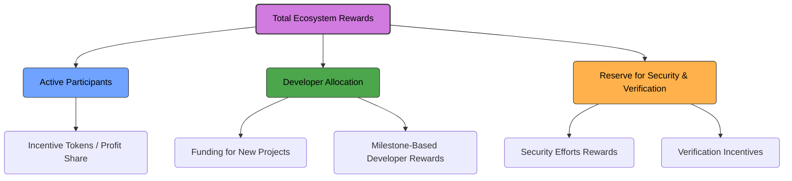

# 🌐 Ecosystem Rewards Diagram

This diagram demonstrates how rewards are distributed across the ecosystem:

- **Active participants** receive incentive tokens or profits.  
- **New projects** are funded through part of the developer allocation.  
- **Security and verification efforts** are rewarded from the reserve.

> **Visual representation:** A network diagram connecting participants, projects, and reward streams.

**Legend:**  
- **Purple →** Total ecosystem rewards  
- **Blue →** Active participant incentives  
- **Green →** Developer allocations  
- **Orange →** Reserve for security & verification
