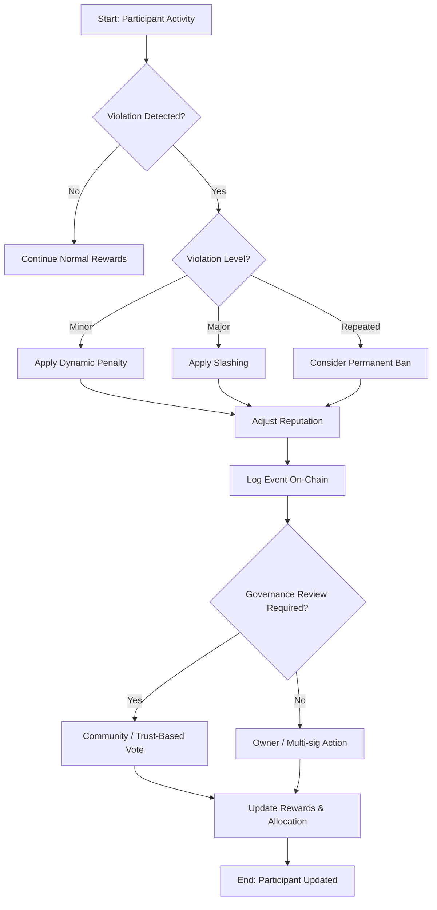

# Security & Penalty Guidelines – Pi Hybrid Token

## Overview
This document outlines the **security framework and penalty mechanisms** for the Pi Hybrid Token ecosystem. It covers:

- Reward suspension  
- Allocation reduction  
- Slashing (from minor to repeated violations)  
- Permanent bans  

All mechanisms emphasize transparency, auditability, and community governance.

---

## 1. Reputation & Penalty Principles

### 1.1 Adjusting Reputation
- When reducing a participant's allocation:  
```text
reputationImpact = amount * 100 / piBalance[participant]
```
- Ensure the participant’s balance is checked to prevent **division by zero**.  
- The recommended order of operations:  
  1. Deduct allocation  
  2. Update balance  
  3. Apply reputation adjustment  
- Goal: encourage responsible behavior and fairness.

### 1.2 Penalty Categories
| Category | Purpose | Managed By |
|----------|---------|------------|
| Financial | Reduce token rewards | Owner / Multi-sig |
| Reputation | Lower participant reputation score | Owner / Multi-sig |
| Governance | Suspend voting rights temporarily | Community vote |
| Permanent Ban | Block participant from ecosystem | Trust-based governance vote |

---

## 2. Reward Suspension
- Reward suspension halts token updates for a defined period.  
- Event logged: `RewardSuspended(participant, duration)`  
- Can be linked to milestone timing for automatic enforcement.

---

## 3. Slashing
- Slashing is **dynamic and recorded on-chain** for all levels of violations.  
- Example function: `slash(percent)`  
- Always check for **balance sufficiency** to prevent errors or underflows.

---

## 4. Control & Governance
- Core functions are restricted to **owner or multi-sig**.  
- Event logging ensures transparency:  
```solidity
event AllocationReduced(address participant, uint256 amount);
event Slashed(address participant, uint256 percent);
event PermanentBan(address participant);
```
- Governance review should complement owner actions to reduce risk of abuse.

---

## 5. Audit & Transparency
- Every action is recorded on-chain and can be queried via API:  
  - Suspended rewards  
  - Reduced allocation  
  - Slashed participants  
  - Permanent bans  
- Enables the community to monitor compliance and fairness.

---

## 6. Performance Considerations
- Frequent updates to `piBalance` can be costly on-chain.  
- Recommended strategies:  
  - Batch processing of multiple participants  
  - Off-chain computation where possible, submitting only final updates on-chain

---

## 7. Edge Case Handling
- Ensure safe behavior for:  
  - Zero balances  
  - Maximum slashing (100%)  
  - Reward suspension durations linked to milestones

---

## 8. Testing & Validation
- Include unit tests covering:  
  - All penalty types  
  - Slashing across different violation levels  
  - Simulation of random participant behavior  
- This ensures reliability, fairness, and auditability before mainnet deployment.

---

## 9. Additional Notes
- All mechanisms are **transaction-driven** and dynamic.  
- Testing must be conducted in a **local or test environment** before mainnet launch.  
- Integration with `BaseLinkedPiWithPenalties.sol` and the README ensures consistent documentation and developer guidance.

---

## 10. Penalty Flow (Mermaid Diagram)


