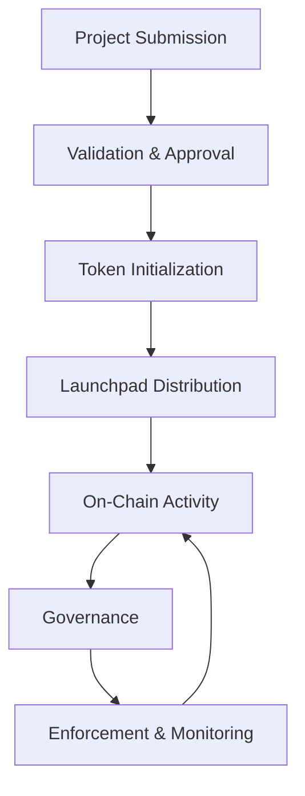

# 🚀 Pi Launchpad Integration Model

---

## 📌 Overview

This document defines how the **Hybrid Token Launch Model** integrates with the **Pi Launchpad** to enable a fair, transparent, and utility-driven token distribution system.

The integration ensures that token launches are:

- Utility-based (not speculative)  
- Verified through real ecosystem activity  
- Governed and monitored on-chain  
- Protected against manipulation and abuse  

---

## 🧩 Role of Pi Launchpad

Pi Launchpad acts as the **entry point for token creation and distribution** within the ecosystem.

### Core Responsibilities:

- Project onboarding and validation  
- Token allocation initialization  
- Controlled distribution to participants  
- Monitoring of ecosystem activity  

---

## ⚙️ Integration Flow

### Step 1 — Project Submission

- Developer submits project to Launchpad  
- Defines:
  - Token utility  
  - Application use-case  
  - Milestone roadmap  
  - Token allocation model (65/20/15)  

---

### Step 2 — Validation & Approval

- Project reviewed based on:
  - Real utility inside Pi ecosystem  
  - Technical feasibility  
  - Security considerations  
  - Compliance requirements  

- Approved projects proceed to token initialization  

---

### Step 3 — Token Initialization

- Token is created with predefined allocation:

| Category              | Percentage |
|----------------------|-----------|
| Liquidity Pools       | 65%       |
| Developers            | 20%       |
| Ecosystem Reserve     | 15%       |

- Smart contracts deployed on Testnet first  

---

### Step 4 — Controlled Distribution

- Tokens are distributed via Launchpad participants  
- Liquidity is gradually activated  
- Developer allocation is locked behind milestones  
- Reserve remains inactive unless triggered  

---

### Step 5 — On-Chain Verification

- All transactions tracked and verified  
- Only **real economic activity** contributes to rewards  
- Profit and usage metrics are recorded on-chain  

---

### Step 6 — Governance Activation

- DAO-like governance enabled  
- Token holders can:
  - Vote on milestones  
  - Approve releases  
  - Trigger penalties  
  - Adjust system parameters  

---

### Step 7 — Enforcement & Monitoring

- Detection layer monitors:
  - Fake activity  
  - Wash trading  
  - Manipulation attempts  

- Penalty mechanisms applied:
  - Reward suspension  
  - Slashing  
  - Reputation reduction  

---

## 🔒 Security Alignment

The Launchpad integration enforces:

- Anti-Sybil protection  
- Verified identity linkage (if required)  
- Transaction pattern analysis  
- Real-time anomaly detection  

---

## 🔄 Lifecycle within Launchpad

---

## 📡 Ecosystem Integration

This model connects directly with:

- **Pi Wallet** → Transaction layer  
- **Pi Browser** → Application interface  
- **Pi Apps** → Real use-case execution  
- **Pi Launchpad** → Token distribution  

---

## ⚠️ Constraints

- Token must have **real utility**  
- Speculative or inactive tokens are not supported  
- Continuous activity is required for reward eligibility  
- Governance participation is mandatory for major changes  

---

## 🎯 Objective

To transform Pi Launchpad into a **controlled economic environment** where:

- Tokens are backed by **real usage**  
- Developers are rewarded **fairly**  
- Users actively participate in **governance**  
- The ecosystem remains **stable and secure**
