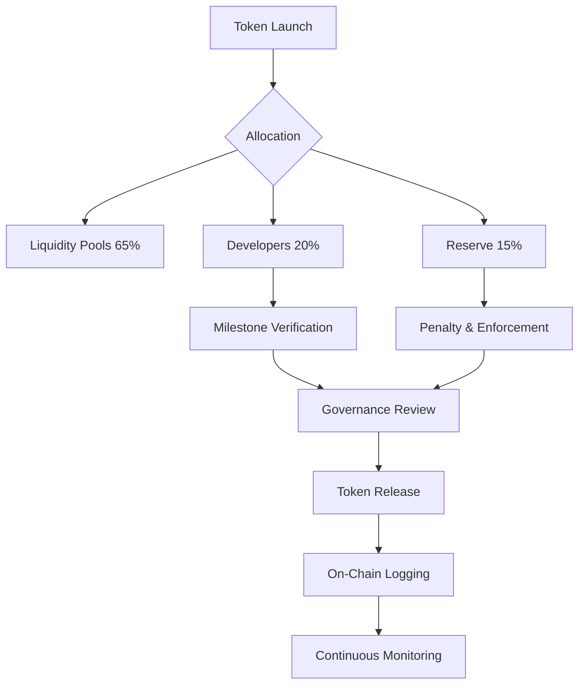

# 🏛️ Hybrid Token Launch Model – Pi Network

---

## 1. Problem Statement

The Pi Network ecosystem requires a sustainable and enforceable token model that addresses:

- Lack of structured liquidity support  
- Unregulated developer incentives  
- Absence of enforcement mechanisms against fraud or abandonment  
- Limited integration between governance and economic activity  

Without these elements, token ecosystems risk instability, misuse, and loss of participant trust.

---

## 2. Proposed Model

This proposal introduces a **Hybrid Token Launch Model** that combines:

- **Liquidity provisioning** for market stability  
- **Milestone-based developer incentives** for responsible growth  
- **Governance-integrated enforcement mechanisms** for accountability  

The model functions as a **proto-financial system**, where token distribution, governance, and penalties are interconnected and executed on-chain.

---

## 3. Token Allocation

| Category             | Percentage | Purpose |
|----------------------|-----------|---------|
| Liquidity Pools      | 65%       | Ensure market stability and on-chain liquidity |
| Developers           | 20%       | Incentivize milestone-based project development |
| Ecosystem Reserve    | 15%       | Support enforcement, penalties, and emergency funding |

**Dynamic Adjustment:**  
The Ecosystem Reserve may decrease over time (e.g., 15% → 10% → 5%) and be redistributed proportionally to liquidity and developer allocations.

---

## 4. Enforcement & Penalty System

The model integrates a **built-in enforcement layer** to ensure responsible participation.

### Key Mechanisms:
- **Slashing:** Reduction of allocated rewards for violations  
- **Allocation Reduction:** Partial withholding of future distributions  
- **Permanent Ban:** Removal from ecosystem participation  

### Trigger Conditions:
- Fraudulent behavior  
- Repeated violations  
- Project abandonment  

### Example On-Chain Events:

```solidity
event AllocationReduced(address participant, uint256 amount);
event Slashed(address participant, uint256 percent);
event PermanentBan(address participant);    D --> F[Governance Review Before Release]
    E --> F
    F --> G[On-Chain Logging & Transparency]
    G --> H[Continuous Monitoring & Adjustment]
```
The **Ecosystem Reserve** acts as a financial buffer to support enforcement execution and system stability.

---

## 5. Governance Layer

Governance is fully integrated into the token lifecycle through a **DAO-like structure**.

### Core Functions:
- Proposal submission  
- Voting mechanisms  
- Execution of approved actions  

### Example On-Chain Events:

```solidity
event ProposalSubmitted(uint256 id, address proposer);
event VoteCast(uint256 id, address voter, bool vote);
event ProposalExecuted(uint256 id, bool success);
```

---

### Governance Scope:
- Approving milestone completion  
- Triggering penalties  
- Managing reserve redistribution  
- Adjusting ecosystem parameters  

Governance operates through a combination of **community voting** and **multi-signature oversight**.

---

## 6. Incentive Mechanism

Developer rewards are distributed based on **verified milestones**, ensuring alignment with long-term ecosystem goals.

### Conditions for Reward Release:
- Demonstrated development progress  
- Milestone verification  
- Governance approval  

### This approach:
- Encourages sustained contribution  
- Prevents short-term exploitation  
- Aligns incentives with ecosystem growth  

---

## 7. Token Flow



---

## 8. Benefits

- Strong and sustainable liquidity  
- Fair, milestone-based developer incentives  
- Integrated enforcement and accountability  
- Transparent and auditable governance  
- Protection against fraud and ecosystem abuse  
- Scalable and adaptable economic model
